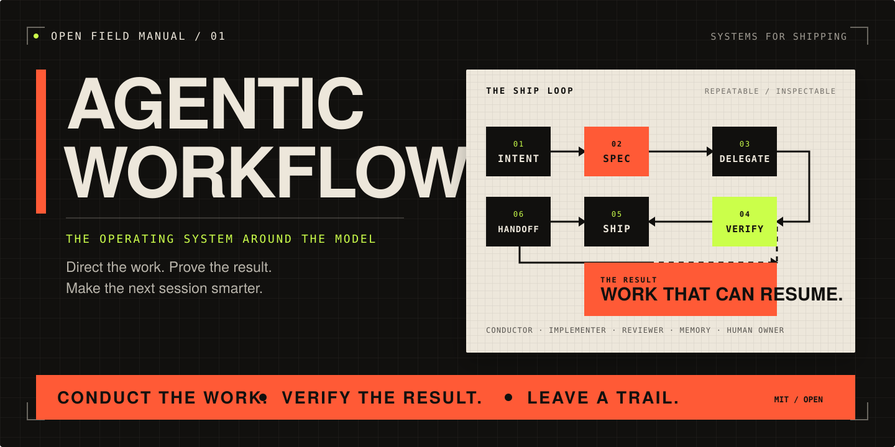

<p align="center">
  
</p>

<h1 align="center">Agentic Workflows</h1>

<p align="center">
  <strong>The open field manual for agent teams that actually finish the job.</strong><br>
  Turn capable coding agents into a system you can direct, inspect, trust, and resume.
</p>

<p align="center">
  <a href="#start-in-three-minutes"><strong>Start in three minutes</strong></a>
  ·
  <a href="docs/diagrams.md">See the system</a>
  ·
  <a href="#pick-your-workflow">Pick a workflow</a>
  ·
  <a href="templates/AGENTS.md">Copy the agent guide</a>
</p>

<p align="center">
  <a href="LICENSE"></a>
  
  
</p>

---

> **A good model can write code. A good operating system gets the code shipped.**

Coding agents rarely fail because they cannot produce a plausible diff. They fail because the work around the model is improvised: context is scattered, mutation boundaries are fuzzy, verification is optional, and the next session has to reconstruct everything from scratch.

Agentic Workflows is a practical kit for fixing that. It gives you the patterns and copyable building blocks for running one agent—or a whole fleet—with clear intent, living specs, review gates, concrete proof, and durable handoffs.

This is not another prompt collection. It is the control layer around the prompt.

## The core loop

```text
INTENT  →  SPEC  →  DELEGATE  →  VERIFY  →  HAND OFF
  ↑                                              │
  └──────────────────── learn ───────────────────┘
```

| Without a workflow | With an operating system |
|---|---|
| Every session starts cold | Project instructions and living specs restore intent |
| “Looks good” becomes the acceptance bar | Commands, artifacts, and review provide proof |
| Agents collide in one giant context | A conductor assigns one bounded slice per agent |
| Decisions disappear into transcripts | Compact handoffs make the next action obvious |
| Push, deploy, and live writes are implied | Explicit gates fail closed before mutation |

## Start in three minutes

You do not need a fleet on day one. Start with the smallest useful loop: one project guide, one acceptance bar, and one clean handoff.

```bash
git clone https://github.com/nathanmauro/agentic-workflows.git ~/agentic-workflows

# From an existing project:
cp ~/agentic-workflows/templates/AGENTS.md ./AGENTS.md
cp ~/agentic-workflows/templates/HANDOFF.md ./HANDOFF.md
```

Then adapt three things in `AGENTS.md`:

1. Name the command that proves a change works.
2. State which mutations need an explicit gate.
3. Require a handoff when work remains.

That alone makes the next agent run more legible, safer, and easier to resume. When the project grows, add the [living spec template](templates/project-spec.md), then graduate to fleet or council workflows only when the coordination cost is real.

## Pick your workflow

| | Workflow | Use it when | Start here |
|---|---|---|---|
| **01** | **Single-agent operating loop** | One agent needs durable context, boundaries, and a real finish line. | [Agentic operating system](docs/concepts/agentic-operating-system.md) |
| **02** | **Fleet execution** | Several projects can move in parallel through one narrow slice each. | [Fleet execution](docs/concepts/fleet-execution.md) · [Codex fleet](docs/workflows/codex-fleet.md) |
| **03** | **Council review** | A consequential decision deserves independent disagreement before commitment. | [Council review](docs/concepts/council-review.md) |
| **04** | **Cross-agent delegation** | Claude and Codex should divide implementation, critique, or verification without blurring ownership. | [Claude from Codex](docs/workflows/claude-from-codex.md) · [Codex from Claude](docs/workflows/codex-from-claude.md) |
| **05** | **Closeout and continuity** | A branch, session, or live-system change must be left in a trustworthy state. | [Closeout and handoff](docs/workflows/closeout-and-handoff.md) |

<p align="center">
  <a href="docs/diagrams.md"><strong>Explore the visual workflow gallery →</strong></a>
</p>

## What is in the kit

```text
agentic-workflows/
├── skills/       portable workflows and runnable helper scripts
├── templates/    agent guides, living specs, handoffs, and adapters
├── examples/     sanitized fleet, council, and continuity artifacts
├── docs/         concepts, step-by-step workflows, and diagrams
└── scripts/      a fail-closed public-release audit
```

### Copyable foundations

- [`AGENTS.md`](templates/AGENTS.md) — a compact project contract for scope, verification, mutation gates, and continuity.
- [`project-spec.md`](templates/project-spec.md) — durable intent plus live round state, decisions, and deferred work.
- [`HANDOFF.md`](templates/HANDOFF.md) — the exact state a future session needs, without a transcript dump.
- [`local-adapters.example.json`](templates/local-adapters.example.json) — clean boundaries for memory, notifications, and session launchers.

### Working patterns

- [`codex-fleet`](skills/codex-fleet/SKILL.md) — conductor-led, multi-project rounds with living specs, a review board, and fail-closed push gates.
- [`claude-remote`](skills/claude-remote/SKILL.md) — a public adaptation for launching bounded Claude review sessions from a Codex-led workflow.
- [`codex-workflow-hybrid`](skills/codex-workflow-hybrid/SKILL.md) — Codex implements while Claude orchestrates and verifies.
- [`codex-workflow-lean`](skills/codex-workflow-lean/SKILL.md) — Codex implements and verifies while Claude stays at the orchestration boundary.
- [`council`](skills/council/SKILL.md) — the protocol for independent opinions, anonymized cross-review, and neutral synthesis. The public v0 documents the adapter contract; bring your own runner.

### Examples you can inspect

- [`fleet-round`](examples/fleet-round/) — one conductor, two fictional projects, one vertical slice each.
- [`durable-handoff`](examples/durable-handoff/) — compact state that another session can responsibly resume.
- [`council-review`](examples/council-review/) — shared context, independent views, adversarial review, and a recorded decision.

## The principles

1. **Treat the harness as the product.** The model is one component. Instructions, tools, specs, gates, and feedback loops determine the outcome.
2. **Give every agent a lane.** One owner, one bounded slice, one acceptance bar. Parallelism without ownership is just faster confusion.
3. **Replace confidence with evidence.** A green command, inspected diff, or verified user flow beats a persuasive summary.
4. **Gate irreversible actions.** Commit, push, deploy, message, and live-write paths should be explicit and fail closed.
5. **Leave the system better informed.** Record decisions and handoffs—not secrets, raw logs, or entire transcripts.

## Read the field manual

| Learn the idea | Put it into practice |
|---|---|
| [Agentic operating system](docs/concepts/agentic-operating-system.md) | [Closeout and handoff](docs/workflows/closeout-and-handoff.md) |
| [Fleet execution](docs/concepts/fleet-execution.md) | [Codex fleet](docs/workflows/codex-fleet.md) |
| [Living specs](docs/concepts/living-specs.md) | [Claude from Codex](docs/workflows/claude-from-codex.md) |
| [Handoffs and continuity](docs/concepts/handoffs-and-continuity.md) | [Codex from Claude](docs/workflows/codex-from-claude.md) |
| [Council review](docs/concepts/council-review.md) | [Workflow diagram gallery](docs/diagrams.md) |

## A living, public field manual

These workflows were distilled from a private local control plane into a curated, public-safe kit. The useful patterns are published; private machine wiring, credentials, account routing, personal context, and raw session data are not. The [private/public boundary](docs/private-public-boundary.md) explains the rule.

The kit is intentionally opinionated and adaptive. Copy what helps. Replace the adapters. Revise the harness when reality proves a better pattern. Keep the discipline that makes agent work inspectable: explicit scope, gated mutations, concrete verification, and a useful handoff.

## Make it yours

If a pattern saves a project—or if reality breaks one—open an issue with the workflow, the failure mode, and what you learned. The goal is not to freeze one person's setup. It is to build a sharper field manual together.

<p align="center">
  <strong>Conduct the work. Verify the result. Leave a trail.</strong><br>
  <sub>MIT licensed · built for adaptation</sub>
</p>
