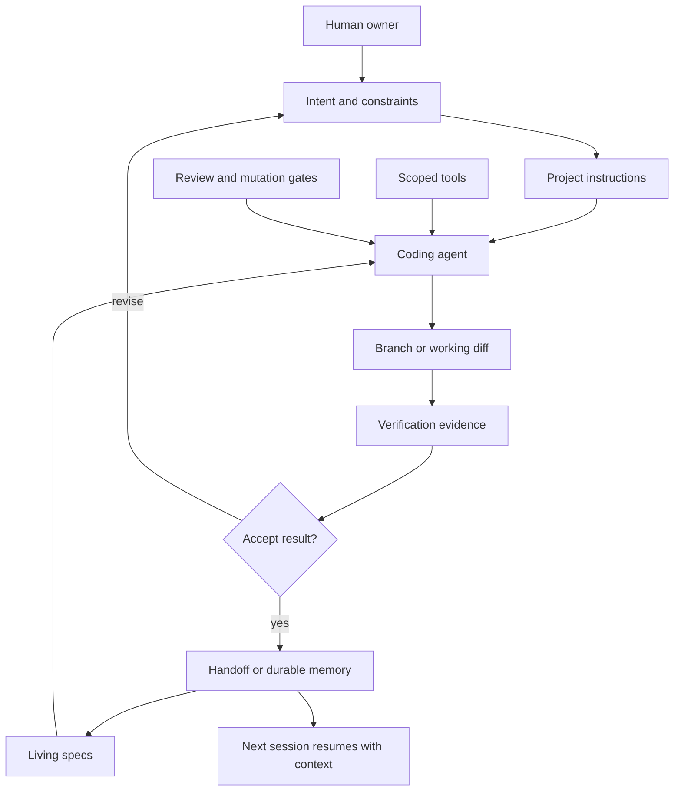
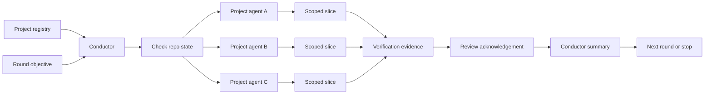
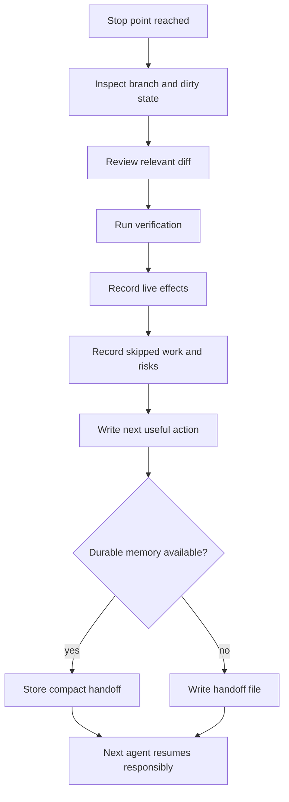
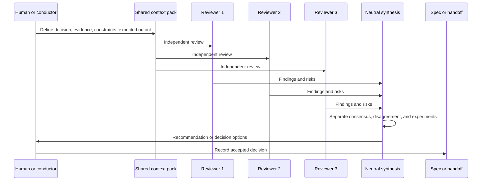
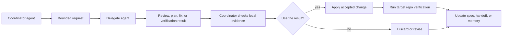
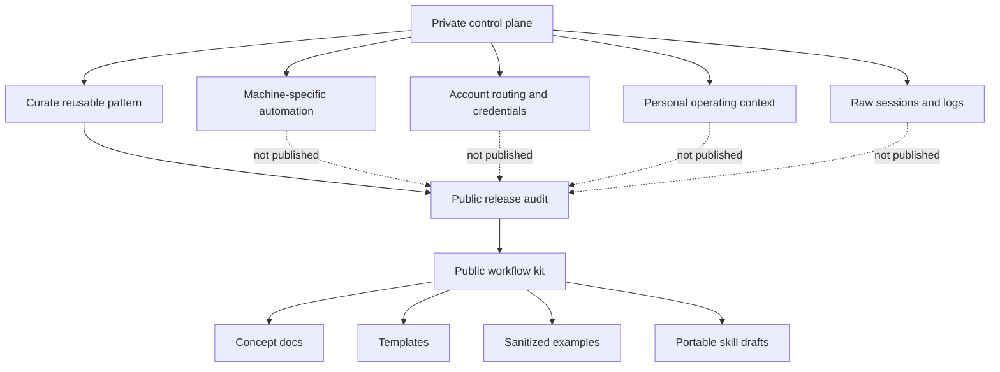

# Workflow Diagrams

These Mermaid diagrams show the operating patterns in this repository at a glance. They are intentionally public-safe: the diagrams describe reusable workflow shapes, not private machine wiring, accounts, or project inventories.

## Agentic Operating System

The model is only one part of the system. Instructions, specs, tools, gates, verification, and handoffs turn isolated agent runs into an inspectable engineering workflow.

## Fleet Round

A fleet round keeps one conductor responsible for scope and review while each project agent works inside one repository on one narrow slice.

## Closeout And Handoff

Closeout is not a transcript dump. It is a compact state record that tells the next session where the work lives, what changed, what was proved, and what to do next.

## Council Review

Council review is useful when independent disagreement can improve a decision. It ends with a recorded decision, experiment, or explicit deferral.

## Claude And Codex Delegation

Delegation does not transfer ownership of truth. The coordinating agent still checks the local repo, accepts or rejects the result, and records decisions that future sessions need.

## Public And Private Boundary

The public artifact is the pattern, not the private implementation. A release audit keeps private wiring, credentials, personal context, and raw logs out of the published kit.
